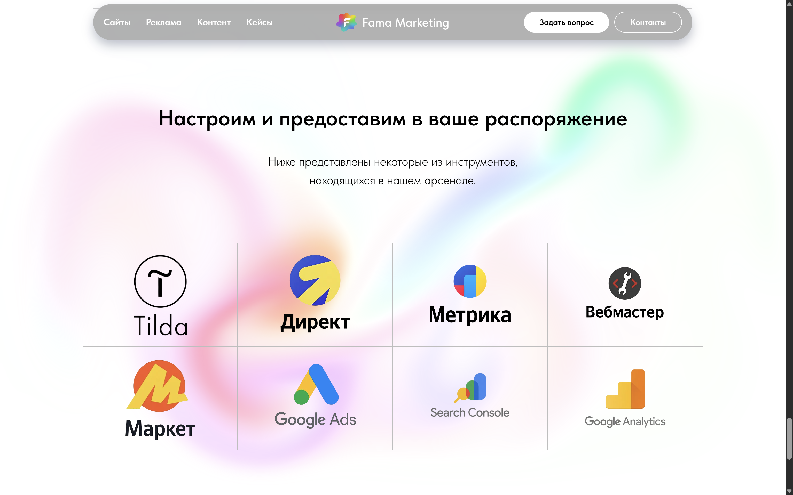

# WebGL Fluid Simulation Background

This project adapts the amazing [WebGL Fluid Simulation by Pavel Dobryakov](https://github.com/PavelDoGreat/WebGL-Fluid-Simulation) for use as an interactive website background.

While the original implementation is incredible, it spans multiple files and can be computationally heavy. To make it more suitable for a background, I simplified and optimized the codebase, restricted the effects to hover interactions, and updated the styling.

You can use this lightweight version to easily add interactive fluid backgrounds to your own website (including on platforms like Tilda).

## Screenshots

<!-- Replace the paths below with the actual paths to your image files -->

*Fluid simulation as a background on a webpage.*

*Standard version.*

## How to Add to Your Website

1. Choose your preferred version by selecting the corresponding folder.
2. Copy all the HTML content from inside the `<body>` element (excluding the `<body>` tags themselves).
3. Paste it into your website's HTML body.

*Note: You may need to adjust the `config` variables within the script and/or tweak the CSS styles to match your specific design needs.*

## Potential Problems & Known Limitations

### Mobile Touch Events vs. Native Scrolling

On mobile browsers, native scrolling strictly overrides JavaScript touch events to preserve performance. When a user swipes to scroll down the page, the browser immediately fires a touchcancel event and stops sending touchmove data to the background canvas. This causes the fluid simulation to appear unresponsive while the page is in motion.

The Solution: Virtual Scrolling
If you require 1:1 pure touch precision for the fluid simulation but still need a scrollable webpage, you must bypass the browser's native scroll engine entirely using a Virtual Scroll (or Smooth Scroll) library.

**Implement a Scroll Library: Use a lightweight virtual scroll engine like Lenis or Locomotive Scroll.**

How it works: These libraries translate scroll inputs into CSS transform: translateY() movements. Because the native scroll engine is never triggered, the browser never hijacks the touch thread, ensuring your WebGL canvas receives 100% of the precise touch data while the user navigates the site.

*Note for Site Builders: If you are implementing this inside a builder like Tilda or Webflow, virtual scroll scripts must be applied to a master wrapper 
 and may conflict with native sticky elements or mobile menus. Test thoroughly.*

## Live Example

You can interact with a live demo of this fluid simulation background at https://fama.marketing.

## License

MIT License

Copyright (c) 2017 Pavel Dobryakov  
Copyright (c) 2026 Makar Pronin

Permission is hereby granted, free of charge, to any person obtaining a copy
of this software and associated documentation files (the "Software"), to deal
in the Software without restriction, including without limitation the rights
to use, copy, modify, merge, publish, distribute, sublicense, and/or sell
copies of the Software, and to permit persons to whom the Software is
furnished to do so, subject to the following conditions:

The above copyright notice and this permission notice shall be included in all
copies or substantial portions of the Software.

THE SOFTWARE IS PROVIDED "AS IS", WITHOUT WARRANTY OF ANY KIND, EXPRESS OR
IMPLIED, INCLUDING BUT NOT LIMITED TO THE WARRANTIES OF MERCHANTABILITY,
FITNESS FOR A PARTICULAR PURPOSE AND NONINFRINGEMENT. IN NO EVENT SHALL THE
AUTHORS OR COPYRIGHT HOLDERS BE LIABLE FOR ANY CLAIM, DAMAGES OR OTHER
LIABILITY, WHETHER IN AN ACTION OF CONTRACT, TORT OR OTHERWISE, ARISING FROM,
OUT OF OR IN CONNECTION WITH THE SOFTWARE OR THE USE OR OTHER DEALINGS IN THE
SOFTWARE.
